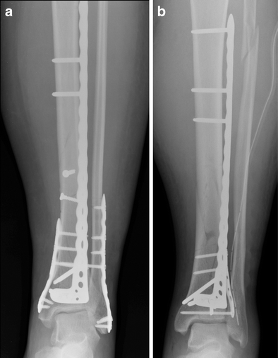

# ehl-munich-august-2026

Cognition "Devin for X" track — an autonomous layer for patient-specific
orthopedic implants (tibial fixation plates).



*A broken shin bone, front (a) and side (b). The metal screwed along the bone to hold the fragments in place while
they heal is the **fixation plate**. 

Today an engineer shapes each one by hand from a CT
scan, over weeks. That is the bottleneck.*

## Repository structure

```
.
├── README.md                          this file
├── LICENSE
│
├── devin-challenge-brief.md           the pitch: domain, verdict engine, autonomy story, risks
├── devin-challenge-alignment-note.md  gap analysis of the brief vs. the track requirements
├── resources.md                       datasets + software the build needs, and their status
├── devin-api-setup.md                 Devin v3 API contract, credential handling (key pending)
│
├── .env.example                       config template — copy to .env, never commit .env
├── .gitignore
│
├── artifacts/
│   ├── image.png                      the track brief slide
│   └── tibial_fixation_plate.png      post-op X-rays, used in this README
│
├── skills-lock.json                   pinned Entire skill versions
├── .agents/skills/                    Entire agent skills (canonical copies, 12 skills)
├── .claude/
│   ├── settings.json
│   └── skills/                        symlinks into ../../.agents/skills/
├── .codex/
│   └── hooks.json                     Codex session hooks
├── agent/skills/                      Entire agent skills (generic-agent copy, 12 skills)
└── .entire/                           Entire session tracking (logs + metadata, gitignored)
    ├── .gitignore
    └── settings.json
```

Docs only so far — no implementation code yet. The Devin API key is still to be
provided; see [devin-api-setup.md](devin-api-setup.md).
